# Setup Guide
Through this guide, you will be introduced to the basic steps for setting up the playback.

## Import Package
First, extract the SDK from the .zip file, copy the **HISPlayer** folder and paste into the **Plugins/** directory in your project’s root (If that directory doesn’t exist, create one).

Then, go into the HISPlayer directory and check that the engine version in your **HISPlayer.uplugin** file is the same as your project’s Unreal version.

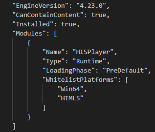

Open your project and go into Edit > Plugins, look for the HISPlayer plugin and if it’s disabled, enable it and restart the project.

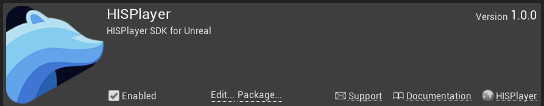

## Import HISPlayer_Blueprint
To use HISPlayer’s functionalities in your Level, you need to add the **HISPlayer_Blueprint**. The is located inside **Content Browser > HISPlayer Content > Blueprint**.

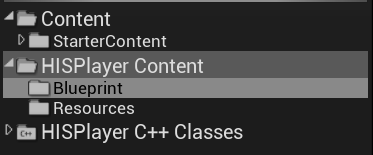

If you can’t find the **HISPlayer Content directory** in the Content Browser, check “Show Plugin Content” in “View Options”.

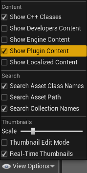

Add the **HISPlayer_Blueprint**.

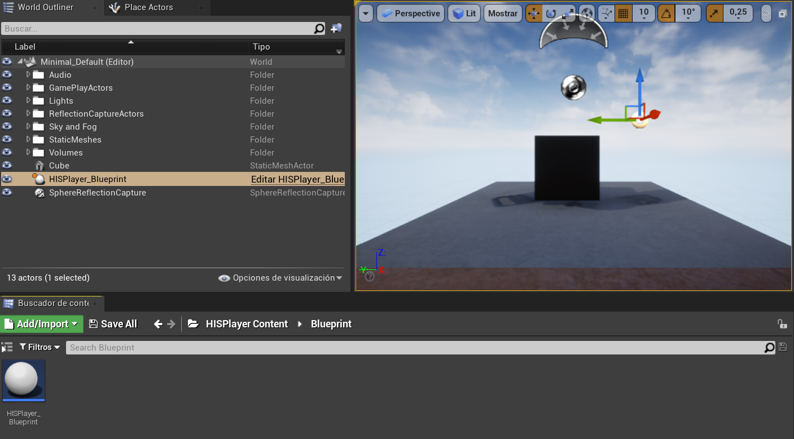

To render the content, you need to set an actor with **HISPlayer_Material** as Material.

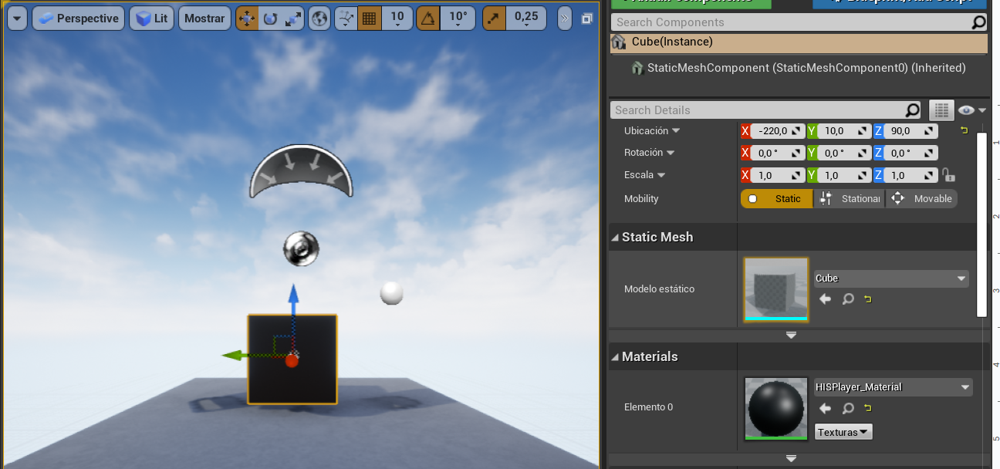

## Configure HISPlayer multistream properties
Set the player’s parameters as desired in your **HISPlayer_Blueprint** actor for single stream and multistream.
It is possible to add more than one stream using one instance of the **HISPlayer_Blueprint**, by adding more elements to the Stream URL and Target Actors arrays.

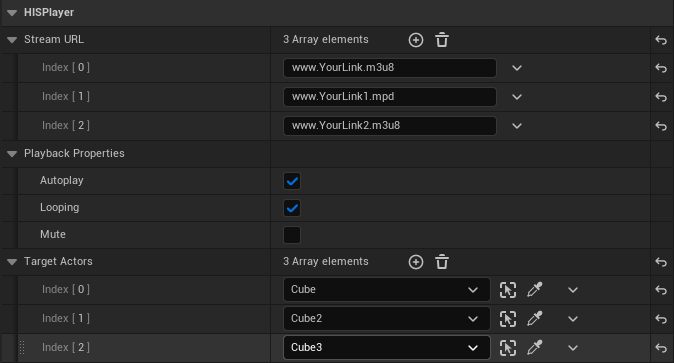

You can modify the behavior of the **HISPlayer_Blueprint** as desired or use a custom blueprint, as long as it follows the original structure.

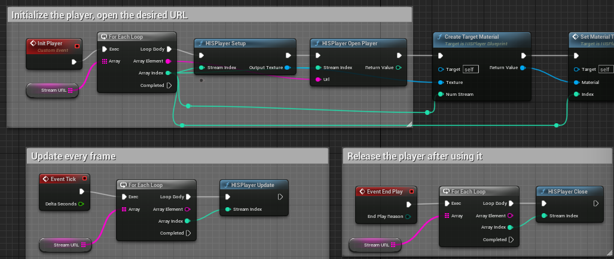

Use the **HISPlayer API** to add your own implementation.

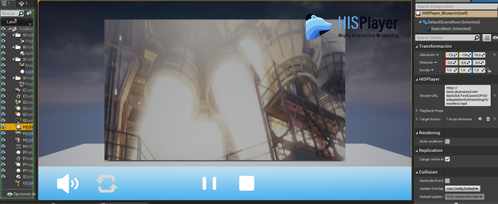

## License Key
Input the license key that is associated with the SDK. If the license key is not valid, the player won’t work and will throw an error message. To find this field, go to the Level Outliner and look for the HISPlayer_Blueprint actor. Then, on the Details window, look for the HISPlayer section.

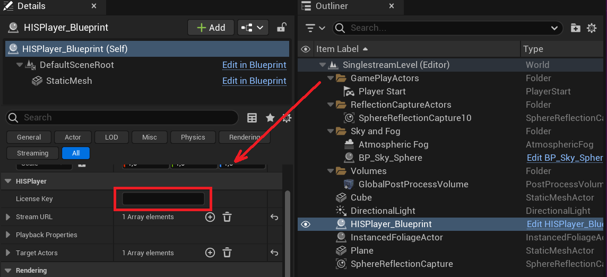

## Disable Anti-Aliasing
If you are experiencing a ghosting effect on the stream, then you will need to disable the anti-aliasing effect on your project. 
To do that on Unreal 5, go to **Edit > Project Settings > Engine > Rendering > Default Settings > Anti-Aliasing Method** and set it to **None**.

## Packaging the project
First, package your project for the HTML5 platform.

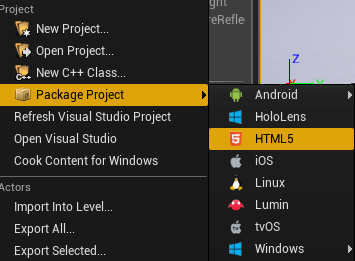

After the project has been packaged, go to the **/HISPlayerHTML5Resources** directory which is located on the HISPlayer SDK root directory ( **Project Root Folder > Plugins > HISPlayer > HISPlayerHTML5Resources**), copy the **/js** folder and the **HISPlayerSample.html** file, and paste them into your project's packaged build folder.

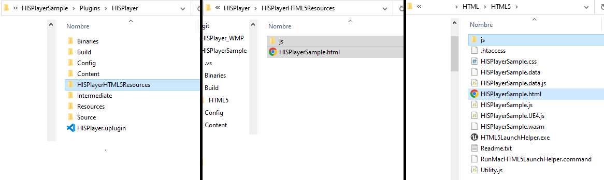

If you want to use a custom HTML file on your packaged project, you will have to include the **hisplayer.js** and **HISPlayerUnreal.js** files contained on the **/js** directory on your HTML file, as shown in the image below:

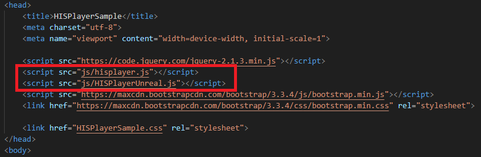

## Updating the SDK

To update a HISPlayer SDK of a previous version, please follow these steps:
* Go to your Root project folder > Plugins and delete the HISPlayer folder.
* Paste your new HISPlayer SDK folder inside the Plugins folder.
* Go again to your Root project folder and delete the Binaries and Intermediate folders.
* Execute Your_Project.uproject file.

Make sure that your project is closed while doing this process.
